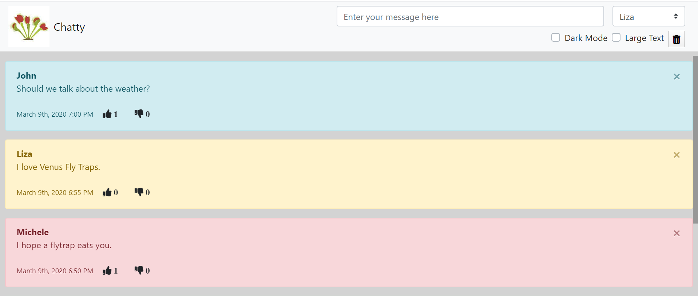

# Chatty-App
## Description
The chatty app is a messaging app created for a group project at Nashville Software School.  The user can select his or her name and then type a message into an input box.  When the message appears in the chat, the user's name appears with a specific color, the timestamp, and a like, dislike, and delete buttons. Other app features include:

* Dark mode and large text checkboxes to edit the viewing experience
* A clear history button to remove all messages from the viewing window
* Messages can only be liked or disliked by a user, they cannot like or dislike a message more than one time, and they cannot like or dislike their own message

## Screenshots

## How To Run
1. Clone down this repo
1. Make sure you have  http-serve installed via npm. If not, get it [HERE](https://npmjs.com/package/http-server).
1. On your command line run `hs -p 9999`
1. In your browser go to `http://localhost:9999`

## Contributors
* Joey Petrone
* John Fleming
* Michele Rawlins
* Liza Star
